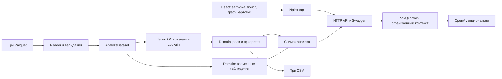

# Граф денег

Инструмент для AML-аналитика / специалиста финансового мониторинга банка: из трёх Parquet он строит направленную сеть, назначает объяснимые роли, выделяет сообщества и приоритеты проверки. Карточка узла показывает связи, ограничения наблюдения, рекомендации по дополнительным данным и временные совпадения. Опциональный AI объясняет готовые факты, не изменяя расчёт.

## Какую проблему решает

В таблице переводов видны отдельные операции, но трудно проследить связи между участниками и понять, с кого начать проверку. Аналитику финансового мониторинга нужно выделить участников со сходными схемами движения денег, увидеть возможный сбор, распределение или транзит средств и обосновать запрос дополнительных данных. При этом выборка неполна: отсутствие переводов в ней не означает отсутствие операций у клиента.

«Граф денег» превращает три файла Parquet в сеть переводов и единый рабочий экран: показывает окружение клиента, объясняет назначенную роль, выделяет сообщества и формирует приоритет проверки. Аналитик получает факты, ограничения наблюдения и рекомендации для дальнейшего расследования. Результаты — гипотезы для проверки, не доказательство виновности; решение принимает специалист.

## Что реализовано

| Возможность | Что получает аналитик | Статус |
|---|---|---|
| Загрузка и проверка данных | Три Parquet через сайт, API или CLI; понятные ошибки, сохранение предыдущего анализа при неудачной загрузке в API | Реализовано |
| Граф и поиск клиента | Направленный подграф окружения, поиск точного gid по всем узлам, переходы между связанными клиентами | Реализовано |
| Объяснимые роли | Шесть ролей по явным правилам, оценка силы эвристики и числовое объяснение для каждого узла | Реализовано |
| Приоритет проверки | Top-20 участников с баллами и объяснениями на основе связей, операций, оборота и соседних seed | Реализовано |
| Сообщества | Кластеры Louvain, их размер, seed, внутренний оборот, ключевые участники и гипотеза | Реализовано |
| Карточка клиента | Входящие и исходящие связи, суммы, роль, глубина и ограничения наблюдения | Реализовано |
| Временные наблюдения | Исходящие через 1–2 дня после поступления, совпадения поступлений от разных отправителей и всплески активности | Реализовано |
| Пробелы данных и следующие запросы | Объяснение неполноты выборки и рекомендации, какие данные запросить; без процента полноты | Реализовано |
| AI-ассистент | Объяснение рассчитанных фактов со ссылками на узлы; роли и баллы остаются результатом алгоритма | Реализовано, нужны ключ и модель |
| Выгрузки и программный доступ | Три серверных CSV: nodes_roles.csv, clusters.csv, top_nodes.csv; CLI, HTTP API и Swagger | Реализовано |
| Повторяющиеся маршруты и возвратные потоки | Поиск повторяющихся цепочек и возврата средств | Не реализовано |
| Отдельный детектор аномалий | Выявление аномалий сверх трёх временных эвристик | Не реализовано |
| Устойчивость сети | Анализ изменения сети при изъятии top-N участников | Не реализовано |

Подробные правила и ограничения приведены ниже; сопоставление с пунктами ТЗ — в разделе [«Соответствие требованиям»](#соответствие-требованиям).

**Проверено 23.09.2026:** 288 backend-тестов, 25 frontend-тестов, Ruff и production-сборка. Chromium прошёл сценарий через локальный Nginx: загрузка **6,51 с**, **2248 узлов / 3119 рёбер**, CSV **2248 / 88 / 20** строк. Один реальный AI-вопрос через UI — HTTP 200 за **9,76 с**. Compose-конфигурация проверена без печати секретов; **контейнерные build/up не проверены: Docker Engine недоступен**. [Протокол интеграции](backend/docs/integration.md). [Предыдущая проверка чистого Python-окружения](backend/docs/reproducibility.md).

## Полное приложение через Docker Compose

Нужны Git, работающий Docker Engine с Linux-контейнерами и Docker Compose v2, доступ к Docker Hub/npm/PyPI при первой сборке. Используются multi-stage Node 24.11.0 → Nginx 1.28 и Python 3.10. Самостоятельно устанавливать Node/Python на хост для этого способа не требуется. На WSL включите интеграцию нужной дистрибуции в Docker Desktop и запустите Engine.

Проверка окружения (без вывода конфигурации секретов):

```bash
docker version
docker compose version
```

Первоначальная настройка, из каталога для проектов:

```bash
git clone --branch refactor/clean-architecture https://github.com/BAITC-Hacks/hack-b7a04bbf-zhastyq.git
cd hack-b7a04bbf-zhastyq
cp -n .env.example .env
mkdir -p backend/data
```

Если репозиторий и `.env` уже есть, сохраните их; не заменяйте ключи. Распакуйте архив организаторов отдельно и скопируйте его `data/nodes.parquet`, `data/edges.parquet`, `data/transactions.parquet` в `backend/data/`. Файлы организаторов не входят в Git/образы. Можно вместо копирования задать в корневом `.env` `DATA_DIR=/absolute/path/to/data`; каталог должен существовать. **Монтирование данных read-only для CLI не загружает анализ автоматически в API.** Для сайта выберите те же файлы через браузер.

Без AI оставьте `OPENAI_API_KEY` и `OPENAI_MODEL` пустыми. Из корня проекта:

```bash
docker compose config --quiet
docker compose up --build -d
```

Приложение: **http://127.0.0.1:8080**; Swagger: **http://127.0.0.1:8080/docs**; health: **http://127.0.0.1:8080/api/health**. Порт меняется через APP_PORT. Он привязан только к localhost; публичное размещение и аутентификация этим этапом не реализуются.

Два сервиса: один Uvicorn worker в `backend`, production React через Nginx в `frontend`. Nginx сохраняет `/api/...`, поддерживает SPA, тело до 76 MiB и ожидание до 360 с. Backend проверяет ≤25 MiB на каждый файл. Браузер не обращается к имени контейнера `backend`. CORS для единого origin не нужен; для отдельного клиента задайте CORS_ORIGINS списком origins через запятую.

**Одна команда CLI-пайплайна внутри запущенного контейнера:**

```bash
docker compose exec backend money-graph analyze --data-dir /app/data --output-dir /app/out/cli
```

Результаты — `nodes_roles.csv`, `clusters.csv`, `top_nodes.csv` в `/app/out/cli`, записываемом named volume `analysis_results`. Скопировать их на хост:

```bash
mkdir -p backend/out
docker compose cp backend:/app/out/cli backend/out/
```

На хосте CSV окажутся в `backend/out/cli/`. Веб-экспорты активного анализа скачиваются тремя кнопками интерфейса; версии API хранятся отдельно в `/app/out/api`. Временные загрузки удаляются после обработки; `/tmp` доступен для записи. После рестарта процесса **повторно загрузите анализ**: снимок в памяти, сохранённые CSV не восстанавливают его автоматически. Named volume остаётся при обычном `down`.

**AI в Compose:** в корневом `.env` задайте OPENAI_API_KEY и доступную вашему аккаунту OPENAI_MODEL; опционально OPENAI_BASE_URL и OPENAI_TIMEOUT_SECONDS (по умолчанию 30). Compose читает этот файл для подстановки; передаются только перечисленные настройки и только backend во время запуска, не при сборке. Переменные shell имеют приоритет. После изменения повторите `docker compose up --build -d`. Frontend собирается с относительным API и без mocks; Vite-настройки фиксируются во время сборки, ключи ему не передаются. Не запускайте `docker compose config` без `--quiet` в публикуемом терминале: он может раскрыть значения.

Без AI-конфигурации анализ, карточки и CSV работают; AI показывает понятную недоступность. `ai_configured` означает наличие настройки, а не гарантию доступности модели.

Логи, проверка и остановка:

```bash
docker compose ps
docker compose logs --tail=100 backend frontend
docker compose down
```

**Область проверки:** на этой машине `docker compose` в WSL требует включить интеграцию Docker Desktop, а Windows docker.exe сообщает отсутствие `dockerDesktopLinuxEngine`. Windows Compose 2.38.2 выполнил `config --quiet`; локальный Nginx 1.22.1, Uvicorn и Chromium подтвердили пользовательский сценарий. Это не проверка сборки образов, volume-разрешений или контейнерной сети. После включения Engine необходимо выполнить build/up по команде выше. Далее приведён проверенный запуск без Docker и методика анализа.

Актуальный контракт: [backend/docs/data_contract.md](backend/docs/data_contract.md). Корневой `docs/data_contract.md` — устаревший документ, не инструкция по подключению: вход сейчас только Parquet, все HTTP gid — точные строки.

## Требования и проверенная среда

- Python **3.10.17**, Linux x86_64 / WSL2, модули `venv` и `ensurepip`; Bash или совместимый shell. В pyproject указано Python >=3.10, но другие версии этой проверкой не подтверждены.
- Git и доступ к репозиторию команды для получения исходников; curl для HTTP-примеров; доступ к индексу Python-пакетов при установке.
- Архив организаторов с исходными Parquet не включён в Git.
- Все данные и NetworkX-граф хранятся в памяти. Проверка выполнена на 2248 узлах, а не на миллионе; минимальные требования RAM/CPU нагрузочными тестами не установлены.
- Версии зависимостей зафиксированы для повторения проверки в [constraints-файле](backend/docs/requirements-verified.txt). Это ограничения для установки проекта через `-c`, не самостоятельный список для `-r`. Python и зависимости сборки setuptools отдельно не поставляются.

Проверить Python до установки:

```bash
python3 --version
python3 -m ensurepip --version
```

Если нет `venv`/`ensurepip`, сначала установите соответствующий пакет вашей ОС или полноценную сборку Python. В проверяемой системе `/usr/bin/python3` версии 3.11.2 не содержит ensurepip; использовался доступный `python3` версии 3.10.17. Команды установки системных пакетов и нативная Windows в этой проверке не тестировались.

## Установка с нуля

Из каталога, в котором ещё нет этой копии репозитория:

```bash
git clone --branch refactor/clean-architecture https://github.com/BAITC-Hacks/hack-b7a04bbf-zhastyq.git
cd hack-b7a04bbf-zhastyq/backend
```

Уже имея репозиторий, просто перейдите в его `backend/`. Следующие команды выполняются оттуда. Активация окружения и uv не требуются:

```bash
mkdir -p .tmp
MG_VENV="${MG_VENV:-.venv}"
test ! -e "$MG_VENV" &&
python3 -m venv "$MG_VENV" &&
TMPDIR="$PWD/.tmp" "$MG_VENV/bin/python" -m pip install --no-cache-dir \
  -c docs/requirements-verified.txt -e '.[dev]'
```

Выполняйте шаги последовательно; при ошибке остановитесь. Если `.venv` уже существует, не пересоздавайте его. Для отдельной проверки вместо него перед блоком выше задайте:

```bash
MG_VENV=".tmp/jury-$(date +%Y%m%d-%H%M%S)-$$"
```

Каталог `.tmp/` исключён из Git. Существующий `.venv` остаётся нетронутым. В новом терминале снова задайте `MG_VENV=.venv` либо путь к созданному временному окружению.

## Данные и один полный расчёт

Распакуйте ZIP организаторов отдельно; путь к архиву замените на фактический:

```bash
"$MG_VENV/bin/python" -m zipfile -e /absolute/path/to/organizer-data.zip .tmp/organizer
```

В предоставленном архиве файлы находятся в папке `data/`. Скопируйте их без переименования в `backend/data/`:

```text
backend/data/nodes.parquet
backend/data/edges.parquet
backend/data/transactions.parquet
```

После распаковки командой выше, из backend:

```bash
mkdir -p data
DATA_SOURCE=.tmp/organizer/data
cp -n "$DATA_SOURCE/nodes.parquet" data/nodes.parquet
cp -n "$DATA_SOURCE/edges.parquet" data/edges.parquet
cp -n "$DATA_SOURCE/transactions.parquet" data/transactions.parquet
```

`cp -n` сохраняет уже имеющиеся файлы; при повторной загрузке убедитесь, что используете нужный набор. Вместо копирования можно передать исходный каталог непосредственно в `--data-dir`. Данные исключены из Git; приложение их не исправляет и не перезаписывает.

Проверка и **одна команда полного анализа**:

```bash
"$MG_VENV/bin/money-graph" validate --data-dir data
"$MG_VENV/bin/money-graph" analyze --data-dir data --output-dir out
```

Результаты: `backend/out/nodes_roles.csv`, `clusters.csv`, `top_nodes.csv`, UTF-8. Для исходного набора validate должен показать 2248 узлов, 3119 рёбер, 4840 транзакций, 81 seed; это проверка этого набора, не ограничение приложения. CLI печатает время полного расчёта. Ошибка валидации — понятное сообщение и ненулевой exit code.

Проверка CSV без внешних утилит:

```bash
"$MG_VENV/bin/python" - <<'PY'
import csv
from pathlib import Path
expected = {'nodes_roles.csv': 2248, 'clusters.csv': 88, 'top_nodes.csv': 20}
for name, count in expected.items():
    with (Path('out') / name).open(encoding='utf-8', newline='') as stream:
        rows = list(csv.DictReader(stream))
    assert len(rows) == count, (name, len(rows))
    print(name, len(rows))
PY
```

88 кластеров — фактический результат исходного набора при текущей версии расчёта. Для другого набора числа могут отличаться. CLI создаёт CSV, но не загружает данные в память отдельно запущенного HTTP-сервера.

## Backend, Swagger и CORS

Из backend, в отдельном терминале, с тем же `MG_VENV`. Запуск **без AI и без чтения .env**:

```bash
MG_VENV="${MG_VENV:-.venv}"
OPENAI_API_KEY= OPENAI_MODEL= \
CORS_ORIGINS=http://localhost:5173,http://127.0.0.1:5173 \
TMPDIR="$PWD/.tmp" "$MG_VENV/bin/uvicorn" money_graph.bootstrap:create_api_app \
  --factory --host 127.0.0.1 --port 8000 --workers 1
```

- API: http://127.0.0.1:8000/api/health
- Swagger: http://127.0.0.1:8000/docs
- OpenAPI: http://127.0.0.1:8000/openapi.json
- CORS_ORIGINS — список разрешённых origins через запятую. Локальный frontend работает на 127.0.0.1:5173 через Vite-прокси; отдельный origin без прокси необходимо добавить в этот список.

В другом терминале, из backend:

```bash
curl --fail-with-body http://127.0.0.1:8000/api/health
curl --fail-with-body -F 'nodes=@data/nodes.parquet' \
  -F 'edges=@data/edges.parquet' -F 'transactions=@data/transactions.parquet' \
  http://127.0.0.1:8000/api/analyze
curl --fail-with-body http://127.0.0.1:8000/api/analysis
curl --fail-with-body http://127.0.0.1:8000/api/nodes/100000003684369100
curl --fail-with-body -o out/downloaded-top_nodes.csv \
  http://127.0.0.1:8000/api/exports/top_nodes.csv
```

До загрузки health возвращает `analysis_ready=false, ai_configured=false`; после загрузки analysis_ready=true. `/api/analysis` и карточки до загрузки возвращают 404 NO_ANALYSIS. Один активный снимок, один процесс/worker. После перезапуска загрузите три файла заново. Ошибка новой загрузки сохраняет старый анализ; параллельный пересчёт получает 409. Лимит 25 MiB на файл. CSV HTTP-анализов хранятся по версиям в `out/api/`, независимо от CLI-выгрузок.

## AI: необязательная настройка

Реализован только OpenAI Responses API. Нужны `OPENAI_API_KEY` и доступная аккаунту `OPENAI_MODEL`; `OPENAI_BASE_URL` по умолчанию `https://api.openai.com/v1`, `OPENAI_TIMEOUT_SECONDS` по умолчанию 30, допустимо 1–120 секунд.

`backend/.env.example` содержит имена переменных без ключа. При первом запуске скопируйте его, только если `.env` ещё нет:

```bash
cp -n .env.example .env
```

Заполните ключ и модель локально в редакторе. Не выводите файл и не добавляйте его в Git. После настройки, остановив предыдущий сервер, запустите:

```bash
TMPDIR="$PWD/.tmp" "$MG_VENV/bin/uvicorn" money_graph.bootstrap:create_api_app \
  --factory --env-file .env --host 127.0.0.1 --port 8000 --workers 1
```

`.env` читает Uvicorn до создания приложения, через установленный python-dotenv; автоматического поиска нет. Если файл лежит в корне проекта, укажите `--env-file ../.env`. Уже заданные переменные окружения, даже пустые, имеют приоритет; перед AI-запуском уберите прежние пустые экспорты ключа/модели или откройте новый терминал. Не выполняйте `.env` через `source`.

Health сообщает наличие полной конфигурации, а не доступность провайдера. Вопрос отправляется через Swagger `POST /api/ask`: текущий analysis_id, вопрос 1–2000 символов и 1–5 выбранных строковых context_gids. Без настройки AI отвечает 503, граф, карточки и CSV работают.

**Ранее выполненная приёмка AI:** 23.09.2026, OpenAI `gpt-6-luna`, один реальный `/api/ask`, HTTP 200 за 8,04 с. Ответ для `100000003684369100` сверён с данными. В интеграционной приёмке выполнен один дополнительный вопрос через UI: HTTP 200 за 9,76 с; доступность модели в другом аккаунте не гарантируется. Сервер проверяет ссылки и добавляет факты, но это не доказывает истинность всего свободного текста модели.

## Пользовательский сценарий и frontend

Для запуска без Docker сначала поднимите backend по команде выше, затем в другом терминале из корня:

```bash
cd frontend
npm ci
npm test
npm run build
npm run dev
```

Требуется Node >=24.11.0 <25; проверены Node 24.21.0 / npm 11.19.0. Приложение http://127.0.0.1:5173, относительный `/api` проксируется на backend:8000. Production-сборку локально можно проверить через `npm run preview` вместо dev. [Подробности frontend](frontend/README.md).

Аналитик загружает три Parquet и ждёт подтверждения расчёта, выбирает узел из top-20 или вводит точный gid + Enter. Поиск использует все узлы, включая изолированные. Граф показывает непосредственное окружение выбранного узла; ограничение обозначено, стрелка направлена к получателю. В карточке доступны суммы, полные списки входящих/исходящих связей, пробелы данных и следующие запросы, раскрываемые временные наблюдения с ограничениями. Ссылки выбирают другой узел.

AI-панель задаёт вопрос по выбранному узлу и текущему analysis_id. Ответ выводится текстом, ссылки открывают карточки; при STALE_ANALYSIS снимок обновляется, вопрос нужно повторить вручную. Три кнопки скачивают серверные CSV. При ошибке загрузки прежний анализ сохраняется; сеть не заменяется демоданными. Смена analysis_id сбрасывает старые карточки и AI-ответы.

## Роли, приоритет и кластеры

I/O — числа входящих/исходящих контрагентов, Vin/Vout — суммы из edges, S — число разных соседних seed, r=Vout/Vin. r трактуется только для не-seed с положительным входом. Применяется **первое** подходящее правило:

| № | Роль | Условие | role_score |
|---|---|---|---|
| 1 | coordinator | I≥3, O≥3, S≥2 | min(1, 0.6+0.05·min(I+O−6,8)) |
| 2 | consolidator | I≥3, Vin≥100000; seed либо r≤0.6 | min(1, 0.65+0.05·min(I−3,7)) |
| 3 | distributor | O≥5, Vout≥100000 | min(1, 0.65+0.05·min(O−5,7)) |
| 4 | transit | не-seed, I>0, O>0, 0.8≤r≤1.2 | 0.9−abs(r−1) |
| 5 | terminal | I>0, O=0, depth<4 | min(0.85, 0.55+0.05·min(I,6)) |
| 6 | peripheral | остальные, включая изолированные | 0.5 |

Баллы — сила эвристики, не статистическая вероятность. Evidence содержит числа и ограничение, максимум 200 символов. Известные gid не используются для назначения ролей.

Для приоритета: D=I+O; T — входящие+исходящие операции из transactions; V=Vin+Vout; S — соседние seed. Для каждого признака `N(x)=ln(1+x)/max_dataset(ln(1+x))`, при нулевом максимуме N=0.

`priority_score = 0.35·N(D) + 0.25·N(T) + 0.25·N(V) + 0.15·N(S)`.

Топ — первые min(20,N) по убыванию балла, затем числовому gid. Баллы сравнимы внутри одного набора. Self-loop в существующем приоритете входит на обеих сторонах; во временной активности считается один раз.

Кластеры: Louvain, NetworkX 3.4.2, seed=42, resolution=1. В ненаправленной проекции встречные суммы складываются; веса нормируются общим максимумом. Внутренний оборот включает каждое исходное направленное ребро ровно один раз. Все узлы сохраняются, изолированные получают отдельные кластеры. Нумерация стабильна по отсортированным gid, ключевые узлы выбираются по приоритету. Гипотезы кластеров формируются локальными правилами.

## Время, полнота и ограничения

- **rapid_outflow:** поступления D и исходящие D+1/D+2; одно наблюдение на узел и D. Self-loop исключён. Это совпадение, а не доказанная трассировка денег; пересекающиеся окна нельзя суммировать как независимые потоки.
- **synchronized_inflow:** минимум три разных внешних отправителя за день; повторные операции не увеличивают число отправителей. Координация не доказана.
- **activity_spike:** минимум пять операций за день и минимум тройное превышение среднего за все 31 день июля, включая нулевые дни. Self-loop учитывается один раз.
- Карточка выдаёт первые 50 наблюдений по дате и виду; total_count и temporal_summary учитывают все находки. Даты без времени не устанавливают порядок операций одного дня.
- data_gaps и next_requests объясняют границу depth=4, неполные входящие seed, изоляцию, превышение исходящих над входящими и общие ограничения. Процент полноты не вычисляется.

Выборка: внутрибанковские переводы за июль 2026 от 5000 KZT, четыре колена от seed. Межбанковские и меньшие переводы могли остаться вне наблюдения; их наличие не утверждается. Полные остатки, внешние поступления, персональные атрибуты и размеченные роли неизвестны. depth=4 без исходящих не доказывает удержание денег; для seed out/in не является достоверным балансом.

Суммы читаются из float64 как Decimal(str(value)), арифметика использует precision=400. Потерянная в источнике точность не восстанавливается. HTTP-суммы — числа для отображения; gid никогда не преобразуются через float. Сверка агрегированных сумм/n_tx edges с transactions пока отсутствует. CSV-вход, циклы/повторяющиеся маршруты, аномалии и анализ устойчивости не реализованы. Авторизации и постоянного восстановления снимка нет; сервер предназначен для локального MVP.

## Схема решения



Domain не зависит от NetworkX/FastAPI. CLI и API используют один сценарий application; bootstrap подключает адаптеры. Карточка получает готовые результаты того же снимка.

## Соответствие требованиям

Матрица сверена с оригинальным «ТЗ кейса для HackAlem AI — Граф денег» (разделы 7–10) и README организаторского датасета. Документы прочитаны из предоставленных локальных материалов, в репозиторий не копируются. Пункты must-have и порядок восьми дополнительных функций ниже соответствуют ТЗ.

| Пункт ТЗ | Требование | Проверенное состояние / пробел |
|---|---|---|
| Must-have 1 | Воспроизводимый пайплайн: один запуск → три CSV, <5 минут | Проверен в чистом Python-окружении: 6,234291 с; новая ОС отдельно не устанавливалась |
| Must-have 2 | Роль, score и evidence у каждого узла | 2248 точных уникальных исходных gid, заполненные поля, допустимые роли/score и evidence ≤200 проверены |
| Must-have 3 | Документированные объяснимые критерии ролей | Все шесть правил, пороги и порядок приведены выше; карточки содержат фактические признаки |
| Must-have 4 | Кластеризация с размером, seed, оборотом и гипотезой | 88 кластеров; CSV и cluster_id узлов проверены |
| Must-have 5 | Топ-лист ≥20 с объяснениями **и визуализация с поиском gid** | Топ-20, направленный подграф, поиск полного набора и карточки проверены в Chromium на исходных данных |
| Доп. 1 | Учёт обрыва графа | Граница depth=4 учитывается в ролях, карточке и рекомендациях; удержание денег не утверждается |
| Доп. 2 | Временные паттерны | Три вида, даты, суммы, показатели и ограничения; доступны в API и карточке интерфейса |
| Доп. 3 | Повторяющиеся маршруты и возвратные потоки | Не реализовано |
| Доп. 4 | Детекция аномалий | Не реализовано; activity_spike — временная эвристика, не отдельный детектор аномалий |
| Доп. 5 | Устойчивость сети при изъятии топ-N | Не реализовано |
| Доп. 6 | AI-ассистент со ссылками на узлы | OpenAI: реальный вопрос через интерфейс, HTTP 200 за 9,76 с; автоматические проверки с fake |
| Доп. 7 | Автогенерация карточки узла | API и интерфейс: роль, потоки, связи, пробелы, временные наблюдения; проверено в Chromium |
| Доп. 8 | Полнота и следующий запрос аналитику | Локальные рекомендации с фактами; процента полноты нет |

Дополнительно к must-have backend поддерживает загрузку новой тройки Parquet через CLI/API с сохранением старого анализа при ошибке. CSV-вход отсутствует; он не входит в исходный формат входа ТЗ. Обязательные CSV генерируются одной командой или скачиваются с сайта; исходные данные и результаты исключены из Git. На демо покажите интерфейс и созданные выгрузки.

## Масштабирование до ~1 млн узлов — план, не реализация

1. Измерить объём рёбер/операций, степень узлов, память и время этапов: число узлов само по себе не определяет стоимость.
2. Перейти от загрузки всего Parquet в Python-объекты к чтению колонок/батчей и внешней агрегации по узлам и дням; хранить агрегаты в колонночном хранилище. Проверять уникальность и ссылки с дисковыми индексами/сортировкой.
3. Заменить объектный NetworkX-граф компактным CSR/CSC или специализированным графовым движком; отдельно выбрать и проверить масштабируемую реализацию сообществ, воспроизводимость и качество разбиения.
4. Вынести расчёт в фоновые задачи с идентификатором задания и прогрессом. Хранить неизменяемые версии результатов и CSV в общем хранилище вместо памяти одного worker.
5. Отдавать подграфы, фильтры, страницы узлов/событий, предварительные агрегаты и top-k. Не отправлять миллион узлов браузеру одним JSON.
6. Добавить лимиты, авторизацию, аудит, наблюдаемость, конкурентный доступ и нагрузочные испытания; AI оставить на ограниченном контексте. Гарантия «<5 минут» на таком объёме сейчас отсутствует.

## Тесты и пятиминутное демо

Из backend, в установленном окружении:

```bash
TMPDIR="$PWD/.tmp" "$MG_VENV/bin/python" -m pytest -q -p no:cacheprovider
"$MG_VENV/bin/ruff" check --no-cache .
"$MG_VENV/bin/ruff" format --check --no-cache .
```

Автоматические тесты не требуют исходного большого набора и блокируют внешний HTTP провайдера. Подробные фактические результаты чистой установки — [протокол воспроизводимости](backend/docs/reproducibility.md).

Демо после установки зависимостей и подготовки файлов; установка не входит в пять минут:

| Время | Действие и ожидаемое наблюдение |
|---|---|
| 0:00–0:40 | validate и одна команда analyze; показать три CSV и измеренное время |
| 0:40–1:20 | Открыть сайт, загрузить три Parquet; дождаться подтверждения расчёта |
| 1:20–2:20 | Показать 2248 узлов, 3119 рёбер и top-20; выбрать на графе или через поиск `100000003684369100` — consolidator, 24 входящих контрагента, seed с неполными входящими |
| 2:20–3:10 | Открыть `100000000018102100`: depth=4, исходящих нет; показать data_gaps и запрос дополнительных данных |
| 3:10–4:10 | Открыть `100000000089154100`: всплеск 16.07, 5 операций на 126500 KZT, среднее 22/31; показать ограничения |
| 4:10–5:00 | Скачать три CSV, открыть AI-панель выбранного узла; при наличии ключа задать вопрос. Без ключа показать понятную недоступность и рассказать о зафиксированной реальной приёмке |

Все три gid взяты из исходных данных, не являются правилами назначения ролей. Для визуального демо откройте сайт, найдите эти gid и раскройте соответствующие блоки карточки. Swagger остаётся дополнительным способом проверки API.
