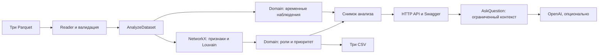

# Граф денег

Backend для AML-аналитика / специалиста финансового мониторинга банка: из трёх Parquet он строит направленную сеть, назначает объяснимые роли, выделяет сообщества и приоритеты проверки. Карточка узла показывает связи, ограничения наблюдения, рекомендации по дополнительным данным и временные совпадения. Опциональный AI объясняет готовые факты, не изменяя расчёт.

**Что можно запустить сейчас:** CLI, HTTP API и Swagger. В текущей feature-ветке нет каталога `frontend/`; готовность сайта и сквозной сценарий в браузере не подтверждены. AI не нужен для расчёта графа и CSV. После установки зависимостей расчёт локален и не требует сети. Результаты — гипотезы для проверки, не доказательство виновности.

**Чистая проверка 23.09.2026:** validate и analyze прошли без AI; полный расчёт — **6,234291 с**, CSV — **2248 / 88 / 20** строк. **288 тестов прошли**, Ruff без ошибок. Проверены Swagger, CORS, HTTP-загрузка и карточки. [Протокол и точная область проверки](backend/docs/reproducibility.md).

Актуальный контракт: [backend/docs/data_contract.md](backend/docs/data_contract.md). Корневой `docs/data_contract.md` — устаревший документ, не инструкция по подключению: вход сейчас только Parquet, все HTTP gid — точные строки.

## Требования и проверенная среда

- Python **3.10.17**, Linux x86_64 / WSL2, модули `venv` и `ensurepip`; Bash или совместимый shell. В pyproject указано Python >=3.10, но другие версии этой проверкой не подтверждены.
- Git и доступ к репозиторию команды для получения исходников; curl для HTTP-примеров; доступ к индексу Python-пакетов при установке.
- Архив организаторов с исходными Parquet не включён в Git.
- Все данные и NetworkX-граф хранятся в памяти. Проверка выполнена на 2248 узлах, а не на миллионе; минимальные требования RAM/CPU нагрузочными тестами не установлены.
- Версии зависимостей зафиксированы для повторения проверки в [constraints-файле](backend/docs/requirements-verified.txt). Это ограничения для установки проекта через `-c`, не самостоятельный список для `-r`. Python и зависимости сборки setuptools отдельно не поставляются.

Проверить Python до установки:

```bash
python3 --version
python3 -m ensurepip --version
```

Если нет `venv`/`ensurepip`, сначала установите соответствующий пакет вашей ОС или полноценную сборку Python. В проверяемой системе `/usr/bin/python3` версии 3.11.2 не содержит ensurepip; использовался доступный `python3` версии 3.10.17. Команды установки системных пакетов и нативная Windows в этой проверке не тестировались.

## Установка с нуля

Из каталога, в котором ещё нет этой копии репозитория:

```bash
git clone --branch refactor/clean-architecture https://github.com/BAITC-Hacks/hack-b7a04bbf-zhastyq.git
cd hack-b7a04bbf-zhastyq/backend
```

Уже имея репозиторий, просто перейдите в его `backend/`. Следующие команды выполняются оттуда. Активация окружения и uv не требуются:

```bash
mkdir -p .tmp
MG_VENV="${MG_VENV:-.venv}"
test ! -e "$MG_VENV" &&
python3 -m venv "$MG_VENV" &&
TMPDIR="$PWD/.tmp" "$MG_VENV/bin/python" -m pip install --no-cache-dir \
  -c docs/requirements-verified.txt -e '.[dev]'
```

Выполняйте шаги последовательно; при ошибке остановитесь. Если `.venv` уже существует, не пересоздавайте его. Для отдельной проверки вместо него перед блоком выше задайте:

```bash
MG_VENV=".tmp/jury-$(date +%Y%m%d-%H%M%S)-$$"
```

Каталог `.tmp/` исключён из Git. Существующий `.venv` остаётся нетронутым. В новом терминале снова задайте `MG_VENV=.venv` либо путь к созданному временному окружению.

## Данные и один полный расчёт

Распакуйте ZIP организаторов отдельно; путь к архиву замените на фактический:

```bash
"$MG_VENV/bin/python" -m zipfile -e /absolute/path/to/organizer-data.zip .tmp/organizer
```

В предоставленном архиве файлы находятся в папке `data/`. Скопируйте их без переименования в `backend/data/`:

```text
backend/data/nodes.parquet
backend/data/edges.parquet
backend/data/transactions.parquet
```

После распаковки командой выше, из backend:

```bash
mkdir -p data
DATA_SOURCE=.tmp/organizer/data
cp -n "$DATA_SOURCE/nodes.parquet" data/nodes.parquet
cp -n "$DATA_SOURCE/edges.parquet" data/edges.parquet
cp -n "$DATA_SOURCE/transactions.parquet" data/transactions.parquet
```

`cp -n` сохраняет уже имеющиеся файлы; при повторной загрузке убедитесь, что используете нужный набор. Вместо копирования можно передать исходный каталог непосредственно в `--data-dir`. Данные исключены из Git; приложение их не исправляет и не перезаписывает.

Проверка и **одна команда полного анализа**:

```bash
"$MG_VENV/bin/money-graph" validate --data-dir data
"$MG_VENV/bin/money-graph" analyze --data-dir data --output-dir out
```

Результаты: `backend/out/nodes_roles.csv`, `clusters.csv`, `top_nodes.csv`, UTF-8. Для исходного набора validate должен показать 2248 узлов, 3119 рёбер, 4840 транзакций, 81 seed; это проверка этого набора, не ограничение приложения. CLI печатает время полного расчёта. Ошибка валидации — понятное сообщение и ненулевой exit code.

Проверка CSV без внешних утилит:

```bash
"$MG_VENV/bin/python" - <<'PY'
import csv
from pathlib import Path
expected = {'nodes_roles.csv': 2248, 'clusters.csv': 88, 'top_nodes.csv': 20}
for name, count in expected.items():
    with (Path('out') / name).open(encoding='utf-8', newline='') as stream:
        rows = list(csv.DictReader(stream))
    assert len(rows) == count, (name, len(rows))
    print(name, len(rows))
PY
```

88 кластеров — фактический результат исходного набора при текущей версии расчёта. Для другого набора числа могут отличаться. CLI создаёт CSV, но не загружает данные в память отдельно запущенного HTTP-сервера.

## Backend, Swagger и CORS

Из backend, в отдельном терминале, с тем же `MG_VENV`. Запуск **без AI и без чтения .env**:

```bash
MG_VENV="${MG_VENV:-.venv}"
OPENAI_API_KEY= OPENAI_MODEL= \
CORS_ORIGINS=http://localhost:5173,http://127.0.0.1:5173 \
TMPDIR="$PWD/.tmp" "$MG_VENV/bin/uvicorn" money_graph.bootstrap:create_api_app \
  --factory --host 127.0.0.1 --port 8000 --workers 1
```

- API: http://127.0.0.1:8000/api/health
- Swagger: http://127.0.0.1:8000/docs
- OpenAPI: http://127.0.0.1:8000/openapi.json
- CORS_ORIGINS — список разрешённых origins через запятую. Порты 5173 в примере — настройка допуска для будущего локального клиента, **не подтверждённый адрес приложения**. Укажите настоящий origin frontend после получения его конфигурации.

В другом терминале, из backend:

```bash
curl --fail-with-body http://127.0.0.1:8000/api/health
curl --fail-with-body -F 'nodes=@data/nodes.parquet' \
  -F 'edges=@data/edges.parquet' -F 'transactions=@data/transactions.parquet' \
  http://127.0.0.1:8000/api/analyze
curl --fail-with-body http://127.0.0.1:8000/api/analysis
curl --fail-with-body http://127.0.0.1:8000/api/nodes/100000003684369100
curl --fail-with-body -o out/downloaded-top_nodes.csv \
  http://127.0.0.1:8000/api/exports/top_nodes.csv
```

До загрузки health возвращает `analysis_ready=false, ai_configured=false`; после загрузки analysis_ready=true. `/api/analysis` и карточки до загрузки возвращают 404 NO_ANALYSIS. Один активный снимок, один процесс/worker. После перезапуска загрузите три файла заново. Ошибка новой загрузки сохраняет старый анализ; параллельный пересчёт получает 409. Лимит 25 MiB на файл. CSV HTTP-анализов хранятся по версиям в `out/api/`, независимо от CLI-выгрузок.

## AI: необязательная настройка

Реализован только OpenAI Responses API. Нужны `OPENAI_API_KEY` и доступная аккаунту `OPENAI_MODEL`; `OPENAI_BASE_URL` по умолчанию `https://api.openai.com/v1`, `OPENAI_TIMEOUT_SECONDS` по умолчанию 30, допустимо 1–120 секунд.

`backend/.env.example` содержит имена переменных без ключа. При первом запуске скопируйте его, только если `.env` ещё нет:

```bash
cp -n .env.example .env
```

Заполните ключ и модель локально в редакторе. Не выводите файл и не добавляйте его в Git. После настройки, остановив предыдущий сервер, запустите:

```bash
TMPDIR="$PWD/.tmp" "$MG_VENV/bin/uvicorn" money_graph.bootstrap:create_api_app \
  --factory --env-file .env --host 127.0.0.1 --port 8000 --workers 1
```

`.env` читает Uvicorn до создания приложения, через установленный python-dotenv; автоматического поиска нет. Если файл лежит в корне проекта, укажите `--env-file ../.env`. Уже заданные переменные окружения, даже пустые, имеют приоритет; перед AI-запуском уберите прежние пустые экспорты ключа/модели или откройте новый терминал. Не выполняйте `.env` через `source`.

Health сообщает наличие полной конфигурации, а не доступность провайдера. Вопрос отправляется через Swagger `POST /api/ask`: текущий analysis_id, вопрос 1–2000 символов и 1–5 выбранных строковых context_gids. Без настройки AI отвечает 503, граф, карточки и CSV работают.

**Ранее выполненная приёмка AI:** 23.09.2026, OpenAI `gpt-6-luna`, один реальный `/api/ask`, HTTP 200 за 8,04 с. Ответ для `100000003684369100` сверён с данными. В текущей проверке платный вызов не повторяется; доступность модели в другом аккаунте не гарантируется. Сервер проверяет ссылки и добавляет факты, но это не доказывает истинность всего свободного текста модели.

## Пользовательский сценарий и frontend

В воспроизводимом сценарии через Swagger аналитик загружает три Parquet, получает analysis_id, открывает `/api/analysis`, выбирает gid из top_nodes, читает карточку и временные наблюдения, скачивает CSV. При настроенном AI задаёт вопрос о выбранном узле. Каждый успешный новый анализ имеет новый analysis_id.

**В этой копии frontend отсутствует.** Нет package.json, подтверждённой команды установки/сборки или адреса сайта. Backend не раздаёт SPA. Swagger подтверждает API, но не заменяет выполненную проверку пользовательского интерфейса.

От frontend-команды нужны:

1. Согласованный commit/ветка с `frontend/`, package.json, lockfile, версией Node и инструкцией запуска.
2. Подключение к актуальному backend-контракту: gid строками, только Parquet, фактические `/api/analysis` и `/api/nodes/{gid}`, ошибки и смена analysis_id.
3. Настройка base URL или dev proxy и реальный origin для CORS.
4. Проверка в браузере загрузки, графа, поиска длинного gid, карточки, экспорта, AI и новых блоков data_gaps/temporal_patterns.

Сборку и браузерную проверку здесь заявлять нельзя. Возможное наличие frontend в другой ветке не подтверждает интеграцию этой копии; этот этап его не переносит и не изменяет.

## Роли, приоритет и кластеры

I/O — числа входящих/исходящих контрагентов, Vin/Vout — суммы из edges, S — число разных соседних seed, r=Vout/Vin. r трактуется только для не-seed с положительным входом. Применяется **первое** подходящее правило:

| № | Роль | Условие | role_score |
|---|---|---|---|
| 1 | coordinator | I≥3, O≥3, S≥2 | min(1, 0.6+0.05·min(I+O−6,8)) |
| 2 | consolidator | I≥3, Vin≥100000; seed либо r≤0.6 | min(1, 0.65+0.05·min(I−3,7)) |
| 3 | distributor | O≥5, Vout≥100000 | min(1, 0.65+0.05·min(O−5,7)) |
| 4 | transit | не-seed, I>0, O>0, 0.8≤r≤1.2 | 0.9−abs(r−1) |
| 5 | terminal | I>0, O=0, depth<4 | min(0.85, 0.55+0.05·min(I,6)) |
| 6 | peripheral | остальные, включая изолированные | 0.5 |

Баллы — сила эвристики, не статистическая вероятность. Evidence содержит числа и ограничение, максимум 200 символов. Известные gid не используются для назначения ролей.

Для приоритета: D=I+O; T — входящие+исходящие операции из transactions; V=Vin+Vout; S — соседние seed. Для каждого признака `N(x)=ln(1+x)/max_dataset(ln(1+x))`, при нулевом максимуме N=0.

`priority_score = 0.35·N(D) + 0.25·N(T) + 0.25·N(V) + 0.15·N(S)`.

Топ — первые min(20,N) по убыванию балла, затем числовому gid. Баллы сравнимы внутри одного набора. Self-loop в существующем приоритете входит на обеих сторонах; во временной активности считается один раз.

Кластеры: Louvain, NetworkX 3.4.2, seed=42, resolution=1. В ненаправленной проекции встречные суммы складываются; веса нормируются общим максимумом. Внутренний оборот включает каждое исходное направленное ребро ровно один раз. Все узлы сохраняются, изолированные получают отдельные кластеры. Нумерация стабильна по отсортированным gid, ключевые узлы выбираются по приоритету. Гипотезы кластеров формируются локальными правилами.

## Время, полнота и ограничения

- **rapid_outflow:** поступления D и исходящие D+1/D+2; одно наблюдение на узел и D. Self-loop исключён. Это совпадение, а не доказанная трассировка денег; пересекающиеся окна нельзя суммировать как независимые потоки.
- **synchronized_inflow:** минимум три разных внешних отправителя за день; повторные операции не увеличивают число отправителей. Координация не доказана.
- **activity_spike:** минимум пять операций за день и минимум тройное превышение среднего за все 31 день июля, включая нулевые дни. Self-loop учитывается один раз.
- Карточка выдаёт первые 50 наблюдений по дате и виду; total_count и temporal_summary учитывают все находки. Даты без времени не устанавливают порядок операций одного дня.
- data_gaps и next_requests объясняют границу depth=4, неполные входящие seed, изоляцию, превышение исходящих над входящими и общие ограничения. Процент полноты не вычисляется.

Выборка: внутрибанковские переводы за июль 2026 от 5000 KZT, четыре колена от seed. Межбанковские и меньшие переводы могли остаться вне наблюдения; их наличие не утверждается. Полные остатки, внешние поступления, персональные атрибуты и размеченные роли неизвестны. depth=4 без исходящих не доказывает удержание денег; для seed out/in не является достоверным балансом.

Суммы читаются из float64 как Decimal(str(value)), арифметика использует precision=400. Потерянная в источнике точность не восстанавливается. HTTP-суммы — числа для отображения; gid никогда не преобразуются через float. Сверка агрегированных сумм/n_tx edges с transactions пока отсутствует. CSV-вход, циклы/повторяющиеся маршруты, аномалии и анализ устойчивости не реализованы. Авторизации и постоянного восстановления снимка нет; сервер предназначен для локального MVP.

## Схема решения



Domain не зависит от NetworkX/FastAPI. CLI и API используют один сценарий application; bootstrap подключает адаптеры. Карточка получает готовые результаты того же снимка.

## Соответствие требованиям

Матрица сверена с оригинальным «ТЗ кейса для HackAlem AI — Граф денег» (разделы 7–10) и README организаторского датасета. Документы прочитаны из предоставленных локальных материалов, в репозиторий не копируются. Пункты must-have и порядок восьми дополнительных функций ниже соответствуют ТЗ.

| Пункт ТЗ | Требование | Проверенное состояние / пробел |
|---|---|---|
| Must-have 1 | Воспроизводимый пайплайн: один запуск → три CSV, <5 минут | Проверен в чистом Python-окружении: 6,234291 с; новая ОС отдельно не устанавливалась |
| Must-have 2 | Роль, score и evidence у каждого узла | 2248 точных уникальных исходных gid, заполненные поля, допустимые роли/score и evidence ≤200 проверены |
| Must-have 3 | Документированные объяснимые критерии ролей | Все шесть правил, пороги и порядок приведены выше; карточки содержат фактические признаки |
| Must-have 4 | Кластеризация с размером, seed, оборотом и гипотезой | 88 кластеров; CSV и cluster_id узлов проверены |
| Must-have 5 | Топ-лист ≥20 с объяснениями **и визуализация с поиском gid** | Топ-20/связи/API готовы; **пункт закрыт частично: frontend в checkout отсутствует, схема сети в браузере не проверена** |
| Доп. 1 | Учёт обрыва графа | Граница depth=4 учитывается в ролях, карточке и рекомендациях; удержание денег не утверждается |
| Доп. 2 | Временные паттерны | Три вида, даты, суммы, показатели и ограничения; доступны через API |
| Доп. 3 | Повторяющиеся маршруты и возвратные потоки | Не реализовано |
| Доп. 4 | Детекция аномалий | Не реализовано; activity_spike — временная эвристика, не отдельный детектор аномалий |
| Доп. 5 | Устойчивость сети при изъятии топ-N | Не реализовано |
| Доп. 6 | AI-ассистент со ссылками на узлы | Один провайдер, ранее принят реальный HTTP-вызов; текущая проверка без платного вызова |
| Доп. 7 | Автогенерация карточки узла | API: роль, потоки, связи, пробелы, временные наблюдения; отображение frontend не проверено |
| Доп. 8 | Полнота и следующий запрос аналитику | Локальные рекомендации с фактами; процента полноты нет |

Дополнительно к must-have backend поддерживает загрузку новой тройки Parquet через CLI/API с сохранением старого анализа при ошибке. CSV-вход отсутствует; он не входит в исходный формат входа ТЗ. Обязательные CSV генерируются локально одной командой и не включаются в этот документационный commit вместе с приватным датасетом. Для сдачи команда должна предъявить созданные выгрузки и экран просмотра; отсутствие последнего нельзя заменить заявлением о готовности Swagger.

## Масштабирование до ~1 млн узлов — план, не реализация

1. Измерить объём рёбер/операций, степень узлов, память и время этапов: число узлов само по себе не определяет стоимость.
2. Перейти от загрузки всего Parquet в Python-объекты к чтению колонок/батчей и внешней агрегации по узлам и дням; хранить агрегаты в колонночном хранилище. Проверять уникальность и ссылки с дисковыми индексами/сортировкой.
3. Заменить объектный NetworkX-граф компактным CSR/CSC или специализированным графовым движком; отдельно выбрать и проверить масштабируемую реализацию сообществ, воспроизводимость и качество разбиения.
4. Вынести расчёт в фоновые задачи с идентификатором задания и прогрессом. Хранить неизменяемые версии результатов и CSV в общем хранилище вместо памяти одного worker.
5. Отдавать подграфы, фильтры, страницы узлов/событий, предварительные агрегаты и top-k. Не отправлять миллион узлов браузеру одним JSON.
6. Добавить лимиты, авторизацию, аудит, наблюдаемость, конкурентный доступ и нагрузочные испытания; AI оставить на ограниченном контексте. Гарантия «<5 минут» на таком объёме сейчас отсутствует.

## Тесты и пятиминутное демо

Из backend, в установленном окружении:

```bash
TMPDIR="$PWD/.tmp" "$MG_VENV/bin/python" -m pytest -q -p no:cacheprovider
"$MG_VENV/bin/ruff" check --no-cache .
"$MG_VENV/bin/ruff" format --check --no-cache .
```

Автоматические тесты не требуют исходного большого набора и блокируют внешний HTTP провайдера. Подробные фактические результаты чистой установки — [протокол воспроизводимости](backend/docs/reproducibility.md).

Демо после установки зависимостей и подготовки файлов; установка не входит в пять минут:

| Время | Действие и ожидаемое наблюдение |
|---|---|
| 0:00–0:40 | validate и одна команда analyze; показать три CSV и измеренное время |
| 0:40–1:20 | Запустить API, открыть Swagger, health без AI; через POST /api/analyze загрузить три файла |
| 1:20–2:20 | `/api/analysis`: 2248 узлов, 3119 рёбер, кластеры, top_nodes; открыть `100000003684369100` — consolidator, 24 входящих контрагента, seed с неполными входящими |
| 2:20–3:10 | Открыть `100000000018102100`: depth=4, исходящих нет; показать data_gaps и запрос дополнительных данных |
| 3:10–4:10 | Открыть `100000000089154100`: всплеск 16.07, 5 операций на 126500 KZT, среднее 22/31; показать ограничения |
| 4:10–5:00 | Скачать top_nodes.csv; объяснить предыдущую AI-приёмку, отсутствие UI и оставшиеся пункты. При заранее настроенном AI можно отдельно задать вопрос, но новый платный вызов не нужен для повторения этой проверки |

Все три gid взяты из исходных данных, не являются правилами назначения ролей. Не выдавайте Swagger-демо за демонстрацию визуального графа. Изменения frontend и продуктовые доработки в этап подготовки README не входят.
