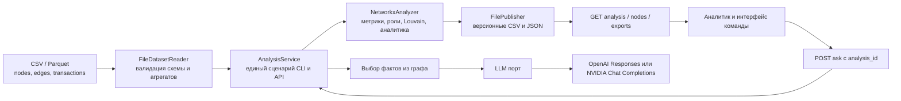

# Архитектура backend

`domain` содержит модели, приоритет и правила ролей без файловой системы или графовых библиотек. `application` задаёт порты и последовательность: чтение → расчёт → публикация → смена активного анализа. `infrastructure` реализует порты. `presentation` преобразует запросы и ошибки. `composition.py` связывает адаптеры.

Граф направленный для потоков и признаков. Louvain использует ненаправленную проекцию только для группировки. Публикация пишет полную версию в отдельную папку и атомарно меняет указатель `current`; ошибка до этого шага оставляет прошлый анализ действующим. Запрос к ИИ получает только выбранные факты и не может изменить расчёт.
